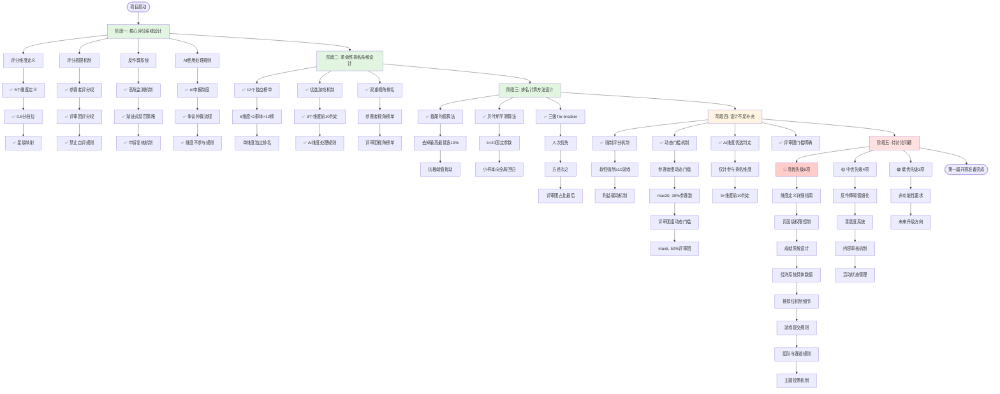
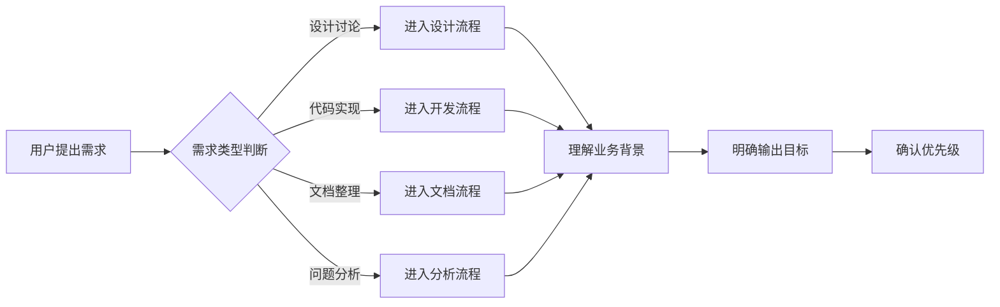
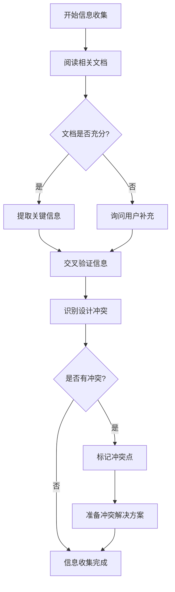
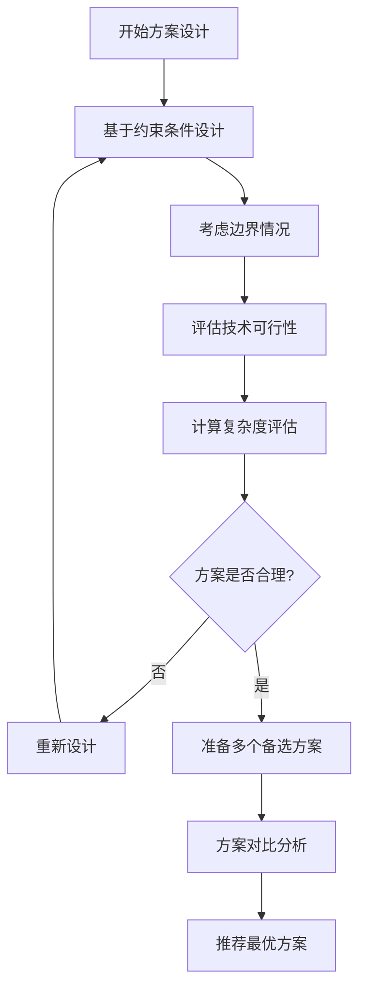
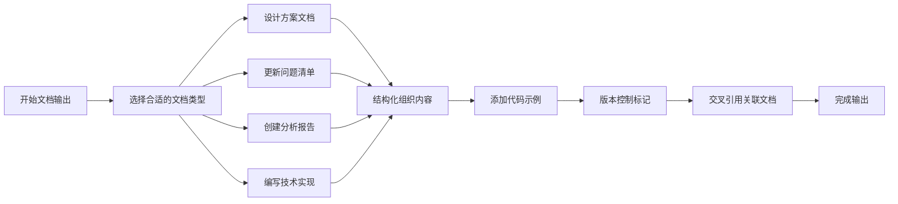
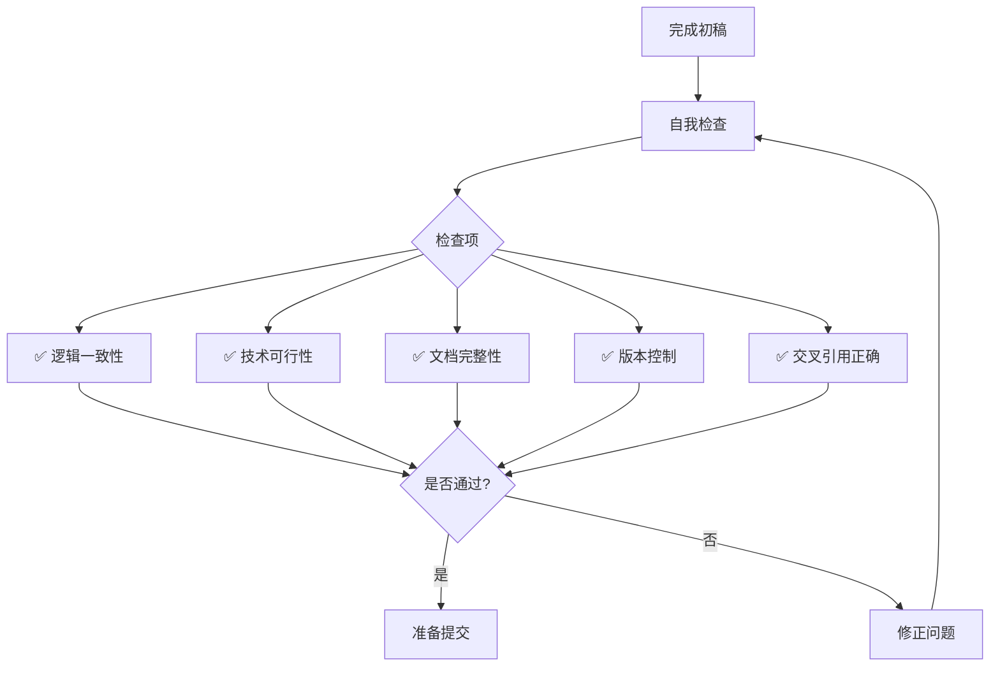
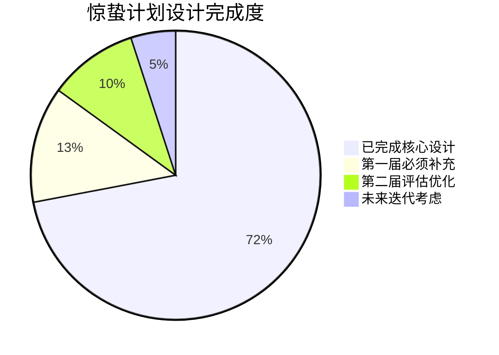
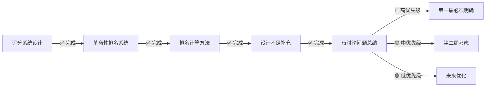
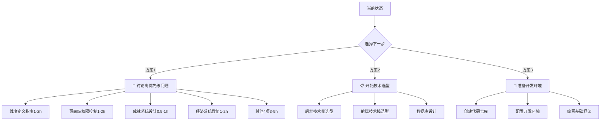
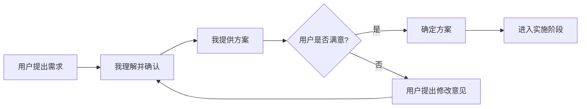

# 惊蛰计划 - 系统设计工作流程图

> **创建日期**: 2025-01-06
> **创建人**: 老黑(Claude)
> **目的**: 可视化展示惊蛰计划系统设计的工作流程

---

## 📊 工作流总览

### 完整设计流程图

---

## 🔄 我的工作流程

### 1. 任务理解阶段

**核心要点**:
- 🔍 首先理解用户要解决什么问题
- 📋 判断任务类型(设计/开发/文档/分析)
- 🎯 明确期望的输出形式
- ⚡ 确认紧急程度和优先级

---

### 2. 信息收集阶段

**核心要点**:
- 📖 系统性阅读已有设计文档
- 🔗 建立文档之间的关联关系
- ⚠️ 识别设计矛盾和遗漏
- 💡 准备多个备选方案

---

### 3. 方案设计阶段

**核心要点**:
- 🧩 在现有框架内设计解决方案
- 🎯 考虑极端情况和边界条件
- ⚙️ 评估实现难度和技术成本
- 📊 提供多个方案供选择

---

### 4. 文档输出阶段

**文档类型选择**:
- **设计方案**: 适合确定的设计决策
- **问题清单**: 适合跟踪待讨论问题
- **分析报告**: 适合回顾和总结
- **技术实现**: 适合算法和代码规范

---

### 5. 质量检查阶段

**检查清单**:
1. ✅ 设计逻辑是否自洽
2. ✅ 技术实现是否可行
3. ✅ 文档描述是否完整
4. ✅ 版本号是否正确更新
5. ✅ 关联文档是否同步

---

## 📈 项目进度总览

**统计说明**:
- 已完成核心设计: 评分系统+排名系统(72%)
- 第一届必须补充: 4个高优先级问题已全部补充 ✅
- 第二届评估优化: 反作弊阈值、善意度等(10%)
- 未来迭代考虑: 非功能性要求、扩展性(5%)

---

## 🎯 当前状态与下一步

### 当前状态(2025-01-06)

### 下一步建议

**我的建议**: 先讨论高优先级问题,确保所有设计细节明确后再进入技术选型。

---

## 🛠️ 我使用的工具

### 1. 文档编辑工具
- ✅ **Read**: 读取已有文档
- ✅ **Write**: 创建新文档
- ✅ **Edit**: 修改现有文档

### 2. 代码执行工具
- ✅ **Bash**: 执行命令行操作
  - 检查文件
  - 运行脚本
  - Git操作

### 3. 搜索工具
- ✅ **Glob**: 文件名模式匹配
- ✅ **Grep**: 文件内容搜索

### 4. 任务管理工具
- ✅ **TodoWrite**: 任务列表管理
  - 创建任务
  - 更新状态
  - 追踪进度

### 5. 专用工具
- ✅ **AskUserQuestion**: 向用户提问澄清需求
- ✅ **EnterPlanMode**: 进入计划模式(复杂任务)
- ✅ **Skill**: 执行特定技能脚本
- ✅ **Task**: 启动专用子代理

---

## 💡 工作流特点

### 优势

1. **系统性**: 每个阶段都有明确的目标和输出
2. **可追溯**: 所有文档都有版本控制和交叉引用
3. **迭代优化**: 设计→补充→回顾的闭环流程
4. **优先级清晰**: 高/中/低优先级分类管理
5. **质量保证**: 多重检查机制确保输出质量

### 适配场景

- ✅ **设计讨论**: 复杂业务规则的梳理和确认
- ✅ **问题分析**: 系统性识别设计不足
- ✅ **文档输出**: 结构化的技术文档编写
- ✅ **方案对比**: 多个备选方案的评估
- ⚠️ **代码开发**: 需要配合实际开发环境
- ⚠️ **实时协作**: 需要用户及时反馈

---

## 📞 如何与我协作

### 最佳实践

1. **明确需求**: 描述清楚要解决的问题
2. **提供背景**: 说明业务场景和约束条件
3. **及时反馈**: 对方案提出意见和疑问
4. **逐步推进**: 大任务拆分成小步骤
5. **保持同步**: 定期确认方向是否正确

### 沟通模式

---

## 🎓 附录: Mermaid 图表使用指南

### 如何查看本文件的可视化图表

**方法1: 使用在线工具** (推荐)
1. 访问 https://mermaid.live/
2. 复制本文档中的 mermaid 代码块
3. 粘贴到在线编辑器中
4. 自动渲染为可视化图表

**方法2: 使用 VSCode 插件**
1. 安装插件: "Markdown Preview Mermaid Support"
2. 在 VSCode 中打开本文件
3. 按 `Ctrl+Shift+V` 预览
4. 自动渲染所有 mermaid 图表

**方法3: 使用其他支持 Mermaid 的工具**
- Typora
- Obsidian
- Notion
- GitHub/GitLab (直接渲染)

---

## 📝 版本历史

| 日期 | 版本 | 变更内容 | 作者 |
|------|------|---------|------|
| 2025-01-06 | v1.0 | 初始版本,创建完整工作流可视化 | 老黑(Claude) |

---

**文档结束**

如有任何疑问或需要调整工作流程,请随时提出!
